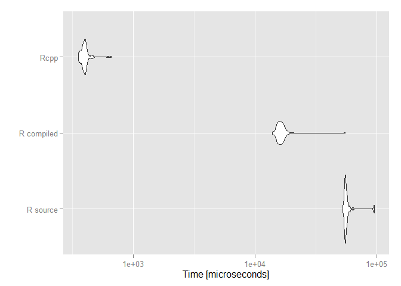

# R Benchmarkings
Francisco Charte Ojeda  
Friday, February 27, 2015  

This document compares the performance in doing a task by means of different approaches in R. For doing so, the `microbenchmark` package is used, measuring the time spent by each approach. The results are shown numerically and plotting them using `ggplot2`. The numeric table shows relative performances, with the best method as `1.0` and the others showing the number of times which they are worse than the former.

The goal is to elucidate which is the best method to accomplish a certain task.

Generating a data.frame containing character data with and without stringsAsFactors
=================

With this code I want to test the difference between using `stringsAsFactors = TRUE` versus `stringsAsFactors = FALSE` while creating a new data.frame.


```r
numElements <- 1e6
someStrings <- sapply(1:25, function(x) paste(sample(c(letters, LETTERS), 10, replace = TRUE), collapse = ""))

aNumericVector <- runif(numElements)
aStringVector <- sample(someStrings, numElements, replace = TRUE)
bStringVector <- sample(someStrings, numElements, replace = TRUE)

result <- microbenchmark(
    data.frame(aNumericVector, aStringVector, bStringVector, stringsAsFactors = TRUE),
    data.frame(aNumericVector, aStringVector, bStringVector, stringsAsFactors = FALSE)
)
```


```
## Unit: relative
##                expr     min       lq     mean  median       uq      max
##  stringsAsFactors=T 320.012 307.7241 304.4763 255.215 364.2376 378.7762
##  stringsAsFactors=F   1.000   1.0000   1.0000   1.000   1.0000   1.0000
##  neval
##    100
##    100
```

 

Conclusion
----------------
Generating a `data.frame` containing character columns is quicker when `stringsAsFactors = FALSE` is used. Nonetheless, it may be taken into account that this option implies the use of more memory, as character strings are stored individually instead of as numeric values referencing the factor levels. For this same reason, further operations such as sorting by a character column can take more time (compared with sorting by a factor column).

Growing list vs preallocated list vs lapply
===============
With the code shown below I want to test the differences between creating a list growing it, preallocating the elements, and using the `lapply` function. 


```r
numElements <- 1e4

result <- microbenchmark(
  { v1 <- list() ; for(i in 1:numElements) v1[[i]] <- someStrings },
  { v2 <- vector('list', numElements) ; for(i in 1:numElements) v2[[i]] <- someStrings },
  { v3 <- lapply(1:numElements, function(i) someStrings)}
)
```


```
## Unit: relative
##               expr       min         lq       mean     median         uq
##         Empty list 99.312841 110.056732 101.092425 108.351391 105.734737
##  Preallocated list  3.523006   3.497653   3.502606   3.449916   3.530715
##             lapply  1.000000   1.000000   1.000000   1.000000   1.000000
##       max neval
##  82.68170   100
##  11.73394   100
##   1.00000   100
```

 

Conclusion
----------------
There is no doubt that growing the list as items are added is a bad idea, since this method is much slower than the other two. The differences between preallocating the list and then populating it with a `for` loop or generating it with the `lapply` function are not as large, but certainly `lapply` has the advantage.

The result should be the same while working with a vector or a data.frame, instead of a list.

$ vs [[ operator
==============
The `$` operator is constantly used in R code to access lists and data.frames elements by name. The operator `[` could be used to do the same task, using numeric indexes instead. Is there any performance difference between them?


```r
aList <- list( a = 5, b = 'list', c = list(c1 = 25))

result <- microbenchmark(
  { c(aList$a, aList$b, aList$c$c1) }, 
  { c(aList[[1]], aList[[2]], aList[[2]][[1]]) }
)
```


```
## Unit: relative
##         expr      min       lq     mean   median       uq       max neval
##   $ operator 1.750341 1.999318 1.648986 1.800327 1.799346 0.9032428   100
##  [[ operator 1.000000 1.000000 1.000000 1.000000 1.000000 1.0000000   100
```

 

Conclusion
------------
Although the difference between the two operators is very tight, it should be taken into account if we use these operators inside a loop or any other repetitve structure. Multiply the small difference by the number of times the operator is used during the program execution to assess if the effort worth it. 

Comparison of two vector values
======

Assume that you want to know which items in a vector `v` (values) have higher values than the corresponding items (by position) in another vector `t` (threshold). The goal is setting to 0 those values. This is a task that can be accomplished in several ways, for instance:


```r
fgen <- function() runif(numElements, 1, 10)
v <- fgen() 
t <- fgen()

result <- microbenchmark(
  { for(i in 1:length(v)) if(v[i] > t[i]) v[i] <- 0 },
  { v <- mapply(function(a,b) if(a > b) 0 else a, v, t) },
  { v[which(v > t)] <- 0 },
  { v[v > t] <- 0 },
  { v <- ifelse(v > t, 0, v) }
)
```


```
## Unit: relative
##    expr        min         lq       mean     median         uq        max
##     for 143.970820 143.186430 131.953767 131.256246 138.412731 106.010333
##  mapply 393.804541 439.768151 410.576911 385.978346 405.311462 589.016210
##   which   1.000000   1.000000   1.000000   1.000000   1.000000   1.000000
##   v > t   5.333333   4.986675   4.288649   4.246307   4.177645   3.478734
##  ifelse  37.382439  35.266623  33.990739  29.547565  30.619796  74.242364
##  neval
##    100
##    100
##    100
##    100
##    100
```

 

As can be seen, `mapply` produces the worst performance, followed by the `for` loop. The quickest way to do the work is almost the simplest one, using the `which` function. This function returns the indexes of elements affected, while  with the expression `v[v > t] <- 0` an array of the same length than `v` and `t` is obtained and all their elements are tested to see if they are `TRUE` or `FALSE` before the assignment.

Simple functions can be vectorized by means of the `Vectorize` function in the base R package. Let us see how this approach performs against the best one of the previous tests:


```r
v <- fgen() 
t <- fgen()
f <- function(a, b) if(a > b) 0 else a
vf <- Vectorize(f)

result <- microbenchmark(
  { v[which(v > t)] <- 0 },
  { v <- vf(v, t) }
)
```


```
## Unit: relative
##       expr      min       lq    mean  median       uq     max neval
##      which   1.0000   1.0000   1.000   1.000   1.0000   1.000   100
##  Vectorize 416.5791 389.8873 401.682 401.581 389.6696 394.292   100
```

 

Conclusion
--------------
When it comes to apply some change to those items in a vector that satisfy a certain restriction, it seems that firstly obtaining the indexes, with the `which` function, and then making the change is the most efficient way of those compared here.

R source code vs R compiled code vs C++ code
======

Sometimes it is not easy to translate a loop into a vectorized expression or a call to `apply`. For instance, this happens when the operation to be made in a cycle depens on the result of a previous iteration. In these cases the loop R function containing the loop can be translated to bytecode, by means of the `cmpfun` function of the `compiler` package. Another alternative would be implementing that loop in C++ taking advantage of the `Rcpp` package. But, is it worth it?

Let us compare the performance of the same task implemented as a R function, as a compiled R function and as a C++ function:


```r
numElements <- 1e5
v <- fgen() 
t <- fgen()

f <- function(v, t) for(i in 1:length(v)) if(v[i] > t[i]) v[i] <- 0
fc <- cmpfun(f)
cppFunction('
    void fCpp(NumericVector v, NumericVector t) {
      for(int i = 0; i < v.size(); i++)
         v[i] = v[i] > t[i] ? 0 : v[i];
    }
')

result <- microbenchmark(f(v, t), fc(v, t), fCpp(v, t))
```


```
## Unit: relative
##        expr       min        lq      mean    median        uq       max
##    R source 148.50908 142.68063 145.23261 139.38388 139.51544 146.35978
##  R compiled  39.12494  40.27761  41.52429  40.69591  41.57373  83.49558
##        Rcpp   1.00000   1.00000   1.00000   1.00000   1.00000   1.00000
##  neval
##    100
##    100
##    100
```

 

As can be seen the C++ function, embedded into R code with the `cppFunction`, is considerably quicker than the other two alternatives. Even compiling to bytecode, without the effort of installing the `Rcpp` package, can be worth it.

Would be the C++ implementation of this task quicker than the `which` function based solution proposed in an earlier section? Let us see:


```r
v <- fgen() 
t <- fgen()

cppFunction('
    void fCpp(NumericVector v, NumericVector t) {
      for(int i = 0; i < v.size(); i++)
         v[i] = v[i] > t[i] ? 0 : v[i];
    }
')

result <- microbenchmark(v[which(v > t)] <- 0, fCpp(v, t))
```


```
## Unit: relative
##   expr      min       lq     mean   median       uq      max neval
##  which 1.173733 1.206826 4.280313 1.632834 3.949873 85.94283   100
##   Rcpp 1.000000 1.000000 1.000000 1.000000 1.000000  1.00000   100
```

 

Although the improvement provided by the C++ function over `which` is not impressive, certainly we can save some time if we are comfortable writing C++ code.
