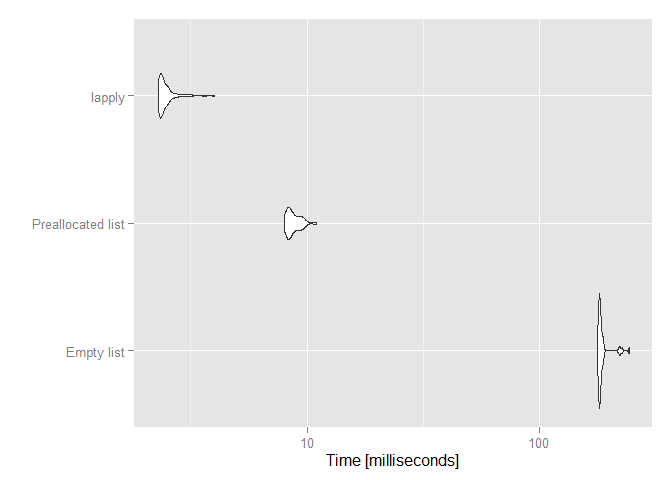
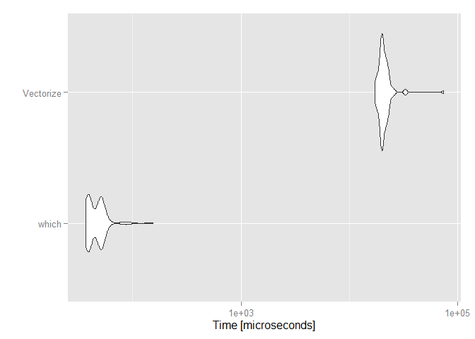

# R Benchmarkings
Francisco Charte Ojeda  
Friday, February 27, 2015  

This document compares the performance in doing a task by means of different approaches in R. For doing so, the `microbenchmark` package is used, measuring the time spent by each approach. The results are shown numerically and plotting them using `ggplot2`.

The goal is to elucidate which is the best method to accomplish a certain task.

Generating a data.frame containing character data with and without stringsAsFactors
=================

With this code I want to test the difference between using `stringsAsFactors = TRUE` versus `stringsAsFactors = FALSE` while creating a new data.frame.


```r
library(microbenchmark)
library(ggplot2)

numElements <- 1e6
someStrings <- sapply(1:25, function(x) paste(sample(c(letters, LETTERS), 10, replace = TRUE), collapse = ""))

aNumericVector <- runif(numElements)
aStringVector <- sample(someStrings, numElements, replace = TRUE)
bStringVector <- sample(someStrings, numElements, replace = TRUE)

result <- microbenchmark(
    data.frame(aNumericVector, aStringVector, bStringVector, stringsAsFactors = TRUE),
    data.frame(aNumericVector, aStringVector, bStringVector, stringsAsFactors = FALSE)
)
```


```
## Unit: microseconds
##                expr       min        lq      mean     median        uq
##  stringsAsFactors=T 63663.300 68011.793 79166.269 70793.0625 98871.511
##  stringsAsFactors=F   202.341   216.087   252.626   256.7755   277.303
##         max neval
##  173628.180   100
##     330.271   100
```

 

Conclusion
----------------
Generating a `data.frame` containing character columns is quicker when `stringsAsFactors = FALSE` is used. Nonetheless, it may be taken into account that this option implies the use of more memory, as character strings are stored individually instead of as numeric values referencing the factor levels. For this same reason, further operations such as sorting by a character column can take more time (compared with sorting by a factor column).

Growing list vs preallocated list vs lapply
===============
With the code shown below I want to test the differences between creating a list growing it, preallocating the elements, and using the `lapply` function. 


```r
numElements <- 1e4

result <- microbenchmark(
  { v1 <- list() ; for(i in 1:numElements) v1[[i]] <- someStrings },
  { v2 <- vector('list', numElements) ; for(i in 1:numElements) v2[[i]] <- someStrings },
  { v3 <- lapply(1:numElements, function(i) someStrings)}
)
```


```
## Unit: milliseconds
##               expr        min         lq       mean     median         uq
##         Empty list 224.685868 257.948932 257.710482 262.888320 265.938461
##  Preallocated list   7.970467   8.197734   8.929039   8.370383   8.880268
##             lapply   2.262405   2.343781   2.549256   2.426257   2.515148
##         max neval
##  310.987875   100
##   44.134482   100
##    3.761266   100
```

 

Conclusion
----------------
There is no doubt that growing the list as items are added is a bad idea, since this method is much slower than the other two. The differences between preallocating the list and then populating it with a `for` loop or generating it with the `lapply` function are not as large, but certainly `lapply` has the advantage.

The result should be the same while working with a vector or a data.frame, instead of a list.

$ vs [[ operator
==============
The `$` operator is constantly used in R code to access lists and data.frames elements by name. The operator `[` could be used to do the same task, using numeric indexes instead. Is there any performance difference between them?


```r
aList <- list( a = 5, b = 'list', c = list(c1 = 25))

result <- microbenchmark(
  { c(aList$a, aList$b, aList$c$c1) }, 
  { c(aList[[1]], aList[[2]], aList[[2]][[1]]) }
)
```


```
## Unit: microseconds
##         expr   min    lq    mean median    uq    max neval
##   $ operator 2.566 2.933 3.56717  3.300 3.300 20.528   100
##  [[ operator 1.466 1.467 2.16325  1.833 1.834 22.727   100
```

 

Conclusion
------------
Although the difference between the two operators is very tight, it should be taken into account if we use these operators inside a loop or any other repetitve structure. Multiply the small difference by the number of times the operator is used during the program execution to assess if the effort worth it. 

Comparison of two vector values
======

Assume that you want to know which items in a vector `v` (values) have higher values than the corresponding items (by position) in another vector `t` (threshold). The goal is setting to 0 those values. This is a task that can be accomplished in several ways, for instance:


```r
fgen <- function() runif(numElements, 1, 10)
v <- fgen() 
t <- fgen()

result <- microbenchmark(
  { for(i in 1:length(v)) if(v[i] > t[i]) v[i] <- 0 },
  { v <- mapply(function(a,b) if(a > b) 0 else a, v, t) },
  { v[which(v > t)] <- 0 },
  { v[v > t] <- 0 },
  { v <- ifelse(v > t, 0, v) }
)
```


```
## Unit: microseconds
##    expr       min         lq       mean     median         uq       max
##     for  5382.925  5904.7220  6666.7661  6543.4520  7280.7865 10064.621
##  mapply 14723.958 18135.1590 20743.7826 19241.9855 21320.1935 55921.199
##   which    37.389    41.2380    50.5235    49.8525    52.6020    94.940
##   v > t   199.408   205.6405   216.6775   211.6890   219.7525   330.271
##  ifelse  1397.692  1454.3250  1717.3311  1473.0200  1610.6625  7048.570
##  neval
##    100
##    100
##    100
##    100
##    100
```

 

As can be seen, `mapply` produces the worst performance, followed by the `for` loop. The quickest way to do the work is almost the simplest one, using the `which` function. This function returns the indexes of elements affected, while  with the expression `v[v > t] <- 0` an array of the same length than `v` and `t` is obtained and all their elements are tested to see if they are `TRUE` or `FALSE` before the assignment.

Simple functions can be vectorized by means of the `Vectorize` function in the base R package. Let us see how this approach performs against the best one of the previous tests:


```r
v <- fgen() 
t <- fgen()
f <- function(a, b) if(a > b) 0 else a
vf <- Vectorize(f)

result <- microbenchmark(
  { v[which(v > t)] <- 0 },
  { v <- vf(v, t) }
)
```


```
## Unit: microseconds
##       expr       min       lq        mean    median         uq       max
##      which    37.389    46.92    52.51384    50.219    56.4505   155.056
##  Vectorize 15575.475 18293.51 21093.86502 20166.998 21997.0455 61137.339
##  neval
##    100
##    100
```

 

Conclusion
--------------
When it comes to apply some change to those items in a vector that satisfy a certain restriction, it seems that firstly obtaining the indexes, with the `which` function, and then making the change is the most efficient way of those compared here.
